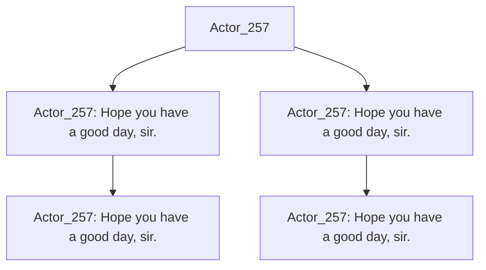

# Characters/Ivan

```mermaid
graph TD
    260_0["Actor_257"]
    260_1["Actor_257: Hope you have a good day, sir."]
    260_2["Actor_257: Hope you have a good day, sir."]
    260_3["Actor_257: Hope you have a good day, sir."]
    260_4["Actor_257: Hope you have a good day, sir."]
    260_0 --> 260_1
    260_0 --> 260_3
    260_1 --> 260_2
    260_3 --> 260_4
```