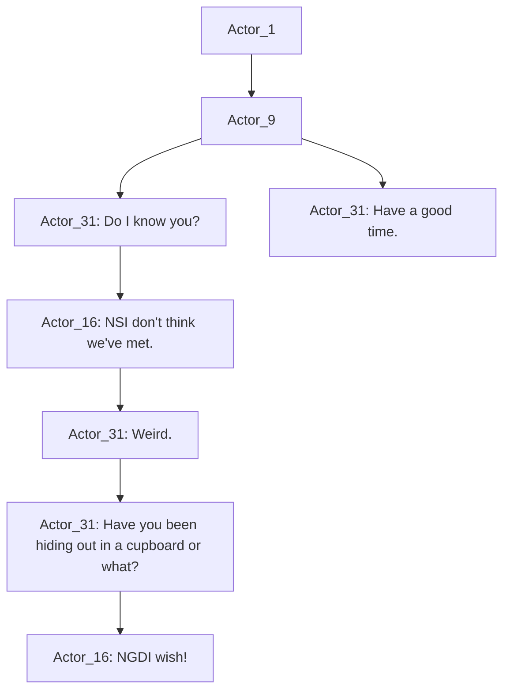

# Characters/Ivo

```mermaid
graph TD
    47_0["Actor_1"]
    47_83["Actor_9"]
    47_149["Actor_31: Do I know you?"]
    47_150["Actor_31: Have a good time."]
    47_182["Actor_16: NSI don't think we've met."]
    47_183["Actor_31: Weird."]
    47_184["Actor_31: Have you been hiding out in a cupboard or what?"]
    47_185["Actor_16: NGDI wish!"]
    47_0 --> 47_83
    47_83 --> 47_149
    47_83 --> 47_150
    47_149 --> 47_182
    47_182 --> 47_183
    47_183 --> 47_184
    47_184 --> 47_185
```