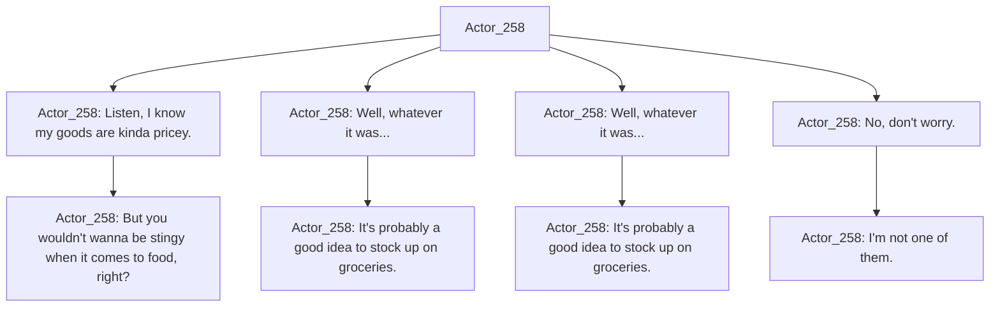

# Characters/Iwo

```mermaid
graph TD
    261_0["Actor_258"]
    261_1["Actor_258: Listen, I know my goods are kinda pricey."]
    261_2["Actor_258: But you wouldn't wanna be stingy when it comes to food, right?"]
    261_3["Actor_258: Well, whatever it was..."]
    261_4["Actor_258: It's probably a good idea to stock up on groceries."]
    261_5["Actor_258: Well, whatever it was..."]
    261_6["Actor_258: It's probably a good idea to stock up on groceries."]
    261_7["Actor_258: No, don't worry."]
    261_8["Actor_258: I'm not one of them."]
    261_0 --> 261_1
    261_0 --> 261_3
    261_0 --> 261_5
    261_0 --> 261_7
    261_1 --> 261_2
    261_3 --> 261_4
    261_5 --> 261_6
    261_7 --> 261_8
```