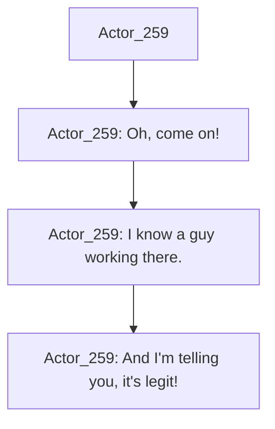

# Characters/Jadran

```mermaid
graph TD
    262_0["Actor_259"]
    262_1["Actor_259: Oh, come on!"]
    262_2["Actor_259: I know a guy working there."]
    262_3["Actor_259: And I'm telling you, it's legit!"]
    262_0 --> 262_1
    262_1 --> 262_2
    262_2 --> 262_3
```