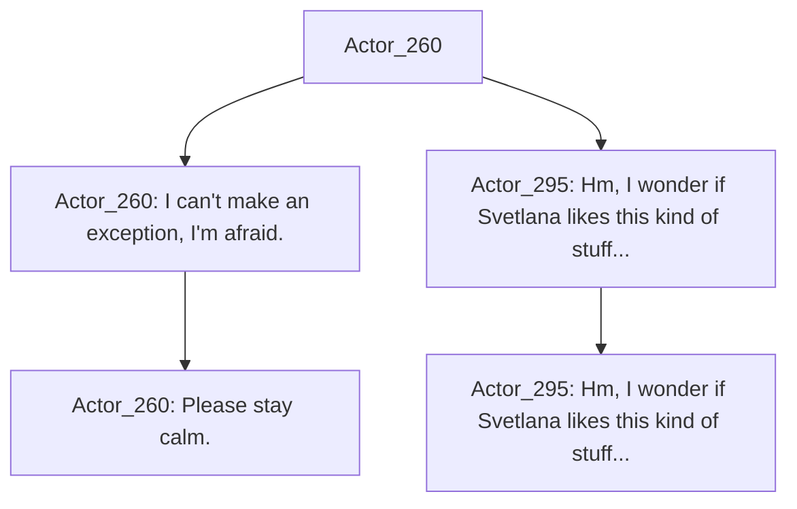

# Characters/Jelka

```mermaid
graph TD
    263_0["Actor_260"]
    263_1["Actor_260: I can't make an exception, I'm afraid."]
    263_2["Actor_260: Please stay calm."]
    263_3["Actor_295: Hm, I wonder if Svetlana likes this kind of stuff..."]
    263_4["Actor_295: Hm, I wonder if Svetlana likes this kind of stuff..."]
    263_0 --> 263_1
    263_0 --> 263_3
    263_1 --> 263_2
    263_3 --> 263_4
```