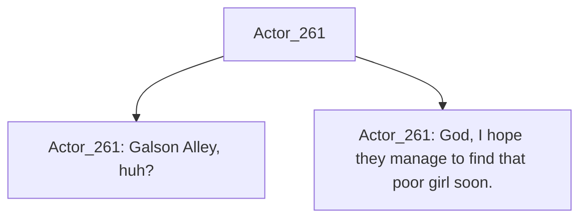

# Characters/Jeremias

```mermaid
graph TD
    264_0["Actor_261"]
    264_1["Actor_261: Galson Alley, huh?"]
    264_2["Actor_261: God, I hope they manage to find that poor girl soon."]
    264_0 --> 264_1
    264_0 --> 264_2
```