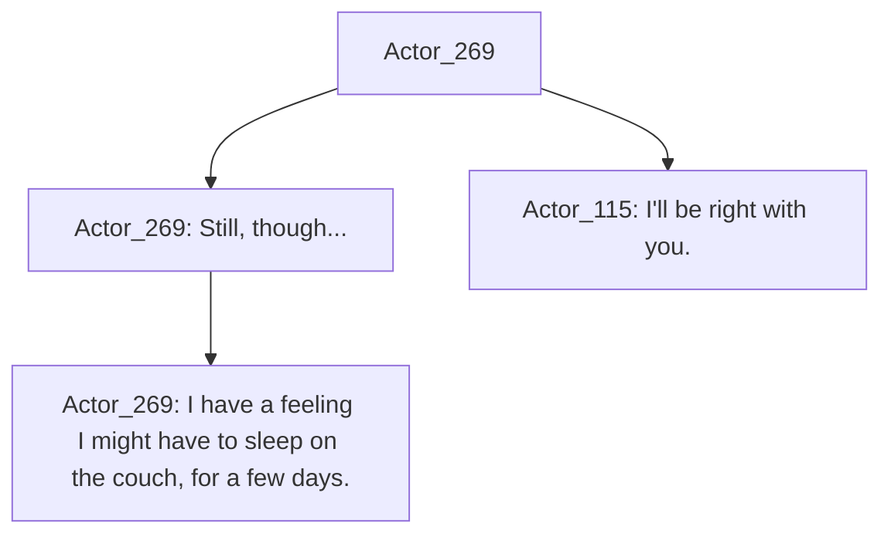

# Characters/Jussi

```mermaid
graph TD
    273_0["Actor_269"]
    273_1["Actor_269: Still, though..."]
    273_2["Actor_269: I have a feeling I might have to sleep on the couch, for a few days."]
    273_3["Actor_115: I'll be right with you."]
    273_0 --> 273_1
    273_0 --> 273_3
    273_1 --> 273_2
```