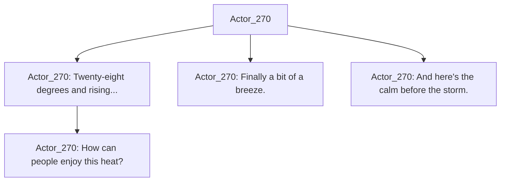

# Characters/Juste

```mermaid
graph TD
    274_0["Actor_270"]
    274_1["Actor_270: Twenty-eight degrees and rising..."]
    274_2["Actor_270: How can people enjoy this heat?"]
    274_3["Actor_270: Finally a bit of a breeze."]
    274_4["Actor_270: And here's the calm before the storm."]
    274_0 --> 274_1
    274_0 --> 274_3
    274_0 --> 274_4
    274_1 --> 274_2
```