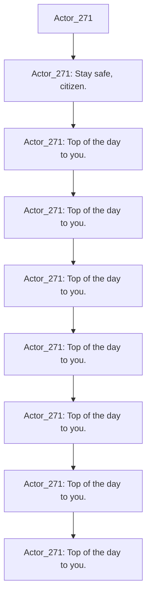

# Characters/Kai

```mermaid
graph TD
    275_0["Actor_271"]
    275_1["Actor_271: Stay safe, citizen."]
    275_2["Actor_271: Top of the day to you."]
    275_3["Actor_271: Top of the day to you."]
    275_4["Actor_271: Top of the day to you."]
    275_5["Actor_271: Top of the day to you."]
    275_6["Actor_271: Top of the day to you."]
    275_7["Actor_271: Top of the day to you."]
    275_8["Actor_271: Top of the day to you."]
    275_0 --> 275_1
    275_1 --> 275_2
    275_2 --> 275_3
    275_3 --> 275_4
    275_4 --> 275_5
    275_5 --> 275_6
    275_6 --> 275_7
    275_7 --> 275_8
```