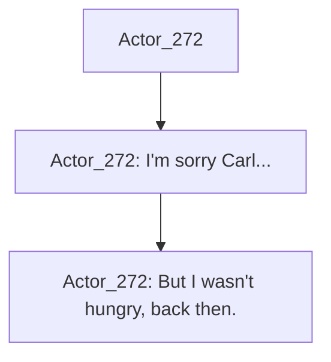

# Characters/Karina

```mermaid
graph TD
    276_0["Actor_272"]
    276_1["Actor_272: I'm sorry Carl..."]
    276_2["Actor_272: But I wasn't hungry, back then."]
    276_0 --> 276_1
    276_1 --> 276_2
```