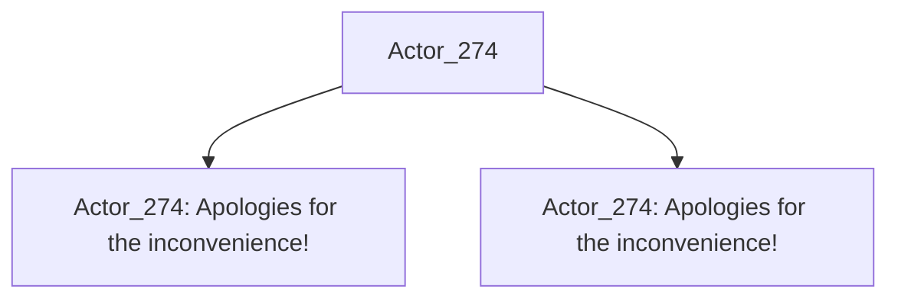

# Characters/Keenan

```mermaid
graph TD
    278_0["Actor_274"]
    278_1["Actor_274: Apologies for the inconvenience!"]
    278_2["Actor_274: Apologies for the inconvenience!"]
    278_0 --> 278_1
    278_0 --> 278_2
```