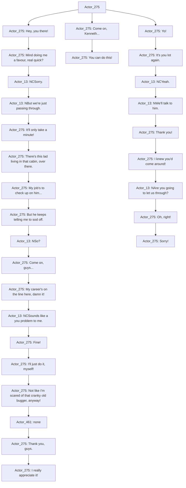

# Characters/Kenneth

```mermaid
graph TD
    279_0["Actor_275"]
    279_1["Actor_275: Hey, you there!"]
    279_2["Actor_275: Mind doing me a favour, real quick?"]
    279_3["Actor_13: NCSorry."]
    279_4["Actor_13: NBut we're just passing through."]
    279_5["Actor_275: It'll only take a minute!"]
    279_6["Actor_275: There's this lad living in that cabin, over there."]
    279_7["Actor_275: My job's to check up on him..."]
    279_8["Actor_275: But he keeps telling me to sod off."]
    279_9["Actor_13: NSo?"]
    279_10["Actor_275: Come on, guys..."]
    279_11["Actor_275: My career's on the line here, damn it!"]
    279_12["Actor_13: NCSounds like a you problem to me."]
    279_13["Actor_275: Fine!"]
    279_14["Actor_275: I'll just do it, myself!"]
    279_15["Actor_275: Not like I'm scared of that cranky old bugger, anyway!"]
    279_16["Actor_461: none"]
    279_17["Actor_275: Thank you, guys."]
    279_18["Actor_275: I really appreciate it!"]
    279_19["Actor_275: Come on, Kenneth..."]
    279_20["Actor_275: You can do this!"]
    279_21["Actor_275: Yo!"]
    279_22["Actor_275: It's you lot again."]
    279_23["Actor_13: NCYeah."]
    279_24["Actor_13: NWe'll talk to him."]
    279_25["Actor_275: Thank you!"]
    279_26["Actor_275: I knew you'd come around!"]
    279_27["Actor_13: NAre you going to let us through?"]
    279_28["Actor_275: Oh, right!"]
    279_29["Actor_275: Sorry!"]
    279_0 --> 279_1
    279_0 --> 279_19
    279_0 --> 279_21
    279_1 --> 279_2
    279_2 --> 279_3
    279_3 --> 279_4
    279_4 --> 279_5
    279_5 --> 279_6
    279_6 --> 279_7
    279_7 --> 279_8
    279_8 --> 279_9
    279_9 --> 279_10
    279_10 --> 279_11
    279_11 --> 279_12
    279_12 --> 279_13
    279_13 --> 279_14
    279_14 --> 279_15
    279_15 --> 279_16
    279_16 --> 279_17
    279_17 --> 279_18
    279_19 --> 279_20
    279_21 --> 279_22
    279_22 --> 279_23
    279_23 --> 279_24
    279_24 --> 279_25
    279_25 --> 279_26
    279_26 --> 279_27
    279_27 --> 279_28
    279_28 --> 279_29
```