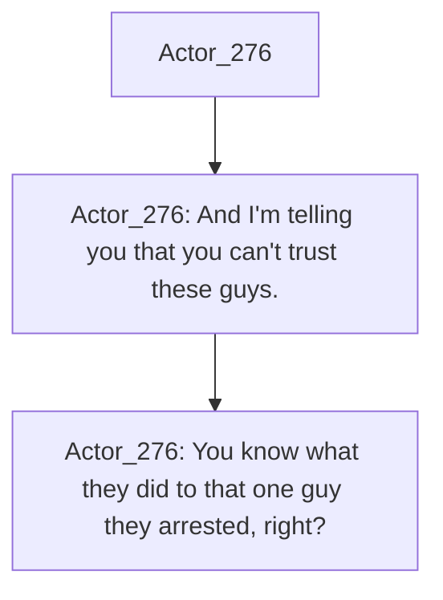

# Characters/Kenyon

```mermaid
graph TD
    280_0["Actor_276"]
    280_1["Actor_276: And I'm telling you that you can't trust these guys."]
    280_2["Actor_276: You know what they did to that one guy they arrested, right?"]
    280_0 --> 280_1
    280_1 --> 280_2
```