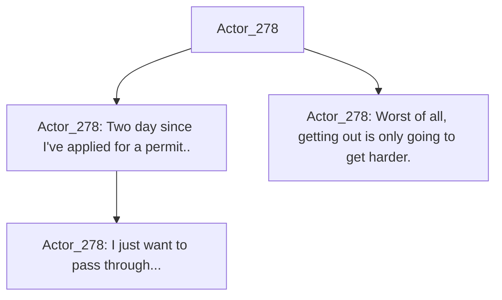

# Characters/Kiro

```mermaid
graph TD
    281_0["Actor_278"]
    281_1["Actor_278: Two day since I've applied for a permit.."]
    281_2["Actor_278: I just want to pass through..."]
    281_3["Actor_278: Worst of all, getting out is only going to get harder."]
    281_0 --> 281_1
    281_0 --> 281_3
    281_1 --> 281_2
```