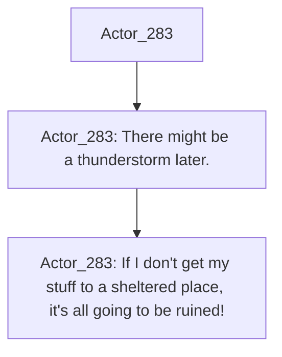

# Characters/Konstantin

```mermaid
graph TD
    285_0["Actor_283"]
    285_1["Actor_283: There might be a thunderstorm later."]
    285_2["Actor_283: If I don't get my stuff to a sheltered place, it's all going to be ruined!"]
    285_0 --> 285_1
    285_1 --> 285_2
```