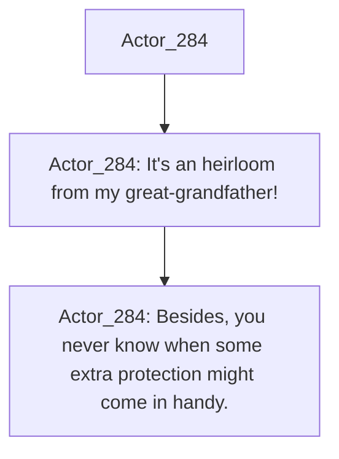

# Characters/Kostas

```mermaid
graph TD
    286_0["Actor_284"]
    286_1["Actor_284: It's an heirloom from my great-grandfather!"]
    286_2["Actor_284: Besides, you never know when some extra protection might come in handy."]
    286_0 --> 286_1
    286_1 --> 286_2
```