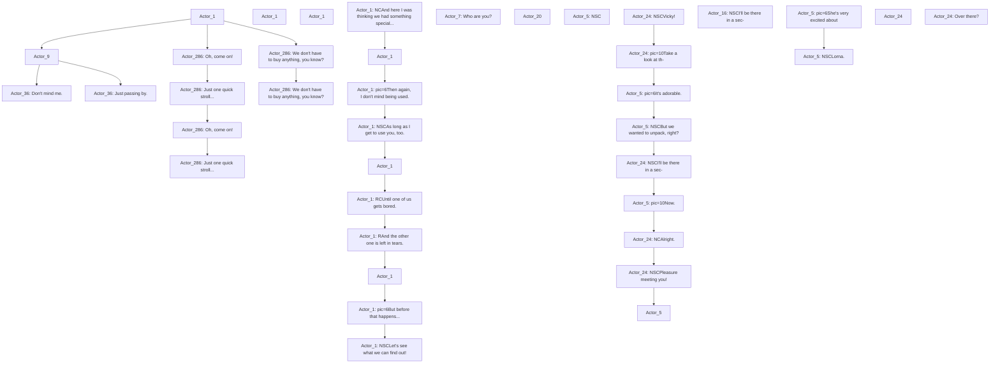

# Characters/Kristina

```mermaid
graph TD
    48_0["Actor_1"]
    48_1["Actor_286: Oh, come on!"]
    48_2["Actor_286: Just one quick stroll..."]
    48_3["Actor_286: Oh, come on!"]
    48_4["Actor_286: Just one quick stroll..."]
    48_5["Actor_286: We don't have to buy anything, you know?"]
    48_6["Actor_286: We don't have to buy anything, you know?"]
    48_19["Actor_1"]
    48_26["Actor_1"]
    48_29["Actor_1: NCAnd here I was thinking we had something special..."]
    48_30["Actor_1"]
    48_31["Actor_1: pic=6Then again, I don't mind being used."]
    48_32["Actor_1: NSCAs long as I get to use you, too."]
    48_33["Actor_1"]
    48_34["Actor_1: pic=6But before that happens..."]
    48_36["Actor_1: NSCLet's see what we can find out!"]
    48_40["Actor_1: RCUntil one of us gets bored."]
    48_41["Actor_1: RAnd the other one is left in tears."]
    48_42["Actor_1"]
    48_75["Actor_7: Who are you?"]
    48_80["Actor_20"]
    48_83["Actor_9"]
    48_86["Actor_5: NSC"]
    48_88["Actor_5: NSCLorna."]
    48_90["Actor_24: NSCVicky!"]
    48_91["Actor_24: pic=10Take a look at th-"]
    48_92["Actor_5: pic=6It's adorable."]
    48_93["Actor_5: NSCBut we wanted to unpack, right?"]
    48_94["Actor_24: NSCI'll be there in a sec-"]
    48_95["Actor_5: pic=10Now."]
    48_96["Actor_16: NSCI'll be there in a sec-"]
    48_97["Actor_24: NCAlright."]
    48_98["Actor_24: NSCPleasure meeting you!"]
    48_102["Actor_5: pic=6She's very excited about "]
    48_104["Actor_24"]
    48_110["Actor_24: Over there?"]
    48_146["Actor_5"]
    48_149["Actor_36: Don't mind me."]
    48_150["Actor_36: Just passing by."]
    48_0 --> 48_83
    48_0 --> 48_1
    48_0 --> 48_5
    48_1 --> 48_2
    48_2 --> 48_3
    48_3 --> 48_4
    48_5 --> 48_6
    48_29 --> 48_30
    48_30 --> 48_31
    48_31 --> 48_32
    48_32 --> 48_33
    48_33 --> 48_40
    48_34 --> 48_36
    48_40 --> 48_41
    48_41 --> 48_42
    48_42 --> 48_34
    48_83 --> 48_149
    48_83 --> 48_150
    48_90 --> 48_91
    48_91 --> 48_92
    48_92 --> 48_93
    48_93 --> 48_94
    48_94 --> 48_95
    48_95 --> 48_97
    48_97 --> 48_98
    48_98 --> 48_146
    48_102 --> 48_88
```