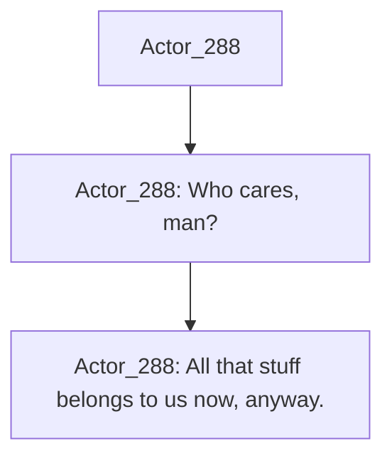

# Characters/Kyriakos

```mermaid
graph TD
    290_0["Actor_288"]
    290_1["Actor_288: Who cares, man?"]
    290_2["Actor_288: All that stuff belongs to us now, anyway."]
    290_0 --> 290_1
    290_1 --> 290_2
```