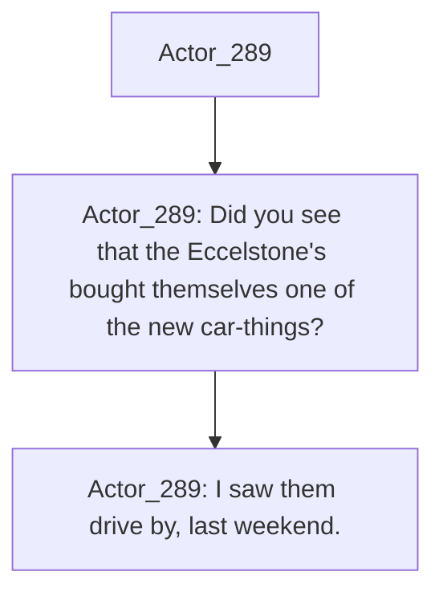

# Characters/Lara

```mermaid
graph TD
    291_0["Actor_289"]
    291_1["Actor_289: Did you see that the Eccelstone's bought themselves one of the new car-things?"]
    291_2["Actor_289: I saw them drive by, last weekend."]
    291_0 --> 291_1
    291_1 --> 291_2
```