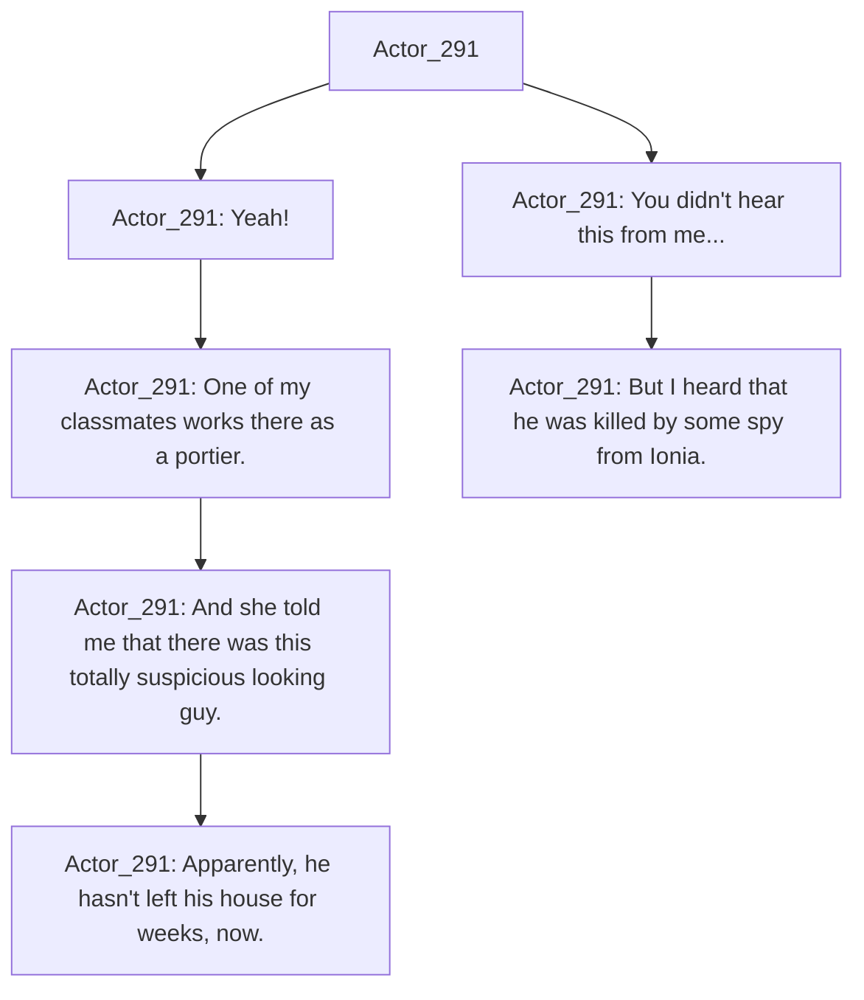

# Characters/Laura

```mermaid
graph TD
    293_0["Actor_291"]
    293_1["Actor_291: Yeah!"]
    293_2["Actor_291: One of my classmates works there as a portier."]
    293_3["Actor_291: And she told me that there was this totally suspicious looking guy."]
    293_4["Actor_291: Apparently, he hasn't left his house for weeks, now."]
    293_5["Actor_291: You didn't hear this from me..."]
    293_6["Actor_291: But I heard that he was killed by some spy from Ionia."]
    293_0 --> 293_1
    293_0 --> 293_5
    293_1 --> 293_2
    293_2 --> 293_3
    293_3 --> 293_4
    293_5 --> 293_6
```