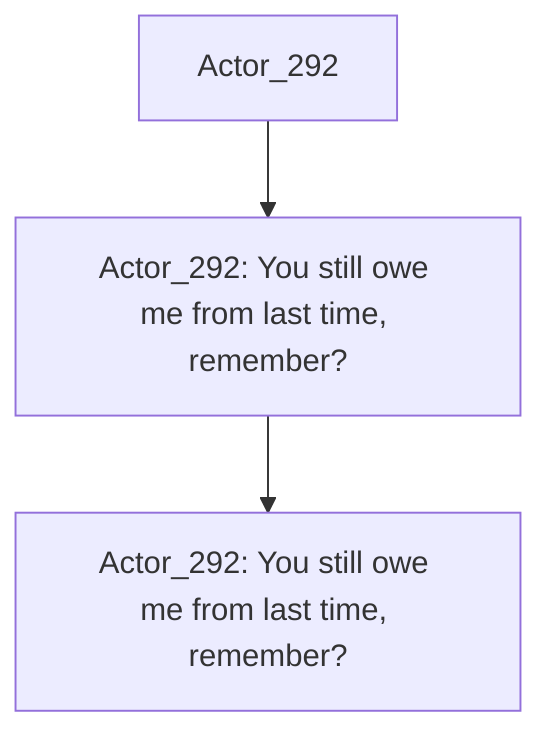

# Characters/Lavra

```mermaid
graph TD
    294_0["Actor_292"]
    294_1["Actor_292: You still owe me from last time, remember?"]
    294_2["Actor_292: You still owe me from last time, remember?"]
    294_0 --> 294_1
    294_1 --> 294_2
```