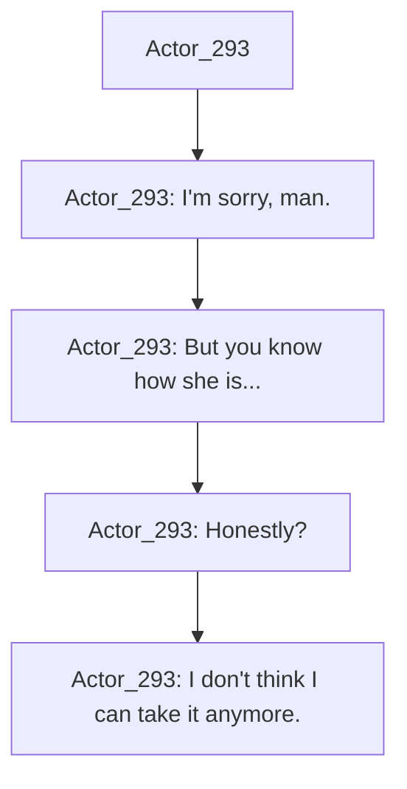

# Characters/Lavrenty

```mermaid
graph TD
    295_0["Actor_293"]
    295_1["Actor_293: I'm sorry, man."]
    295_2["Actor_293: But you know how she is..."]
    295_3["Actor_293: Honestly?"]
    295_4["Actor_293: I don't think I can take it anymore."]
    295_0 --> 295_1
    295_1 --> 295_2
    295_2 --> 295_3
    295_3 --> 295_4
```