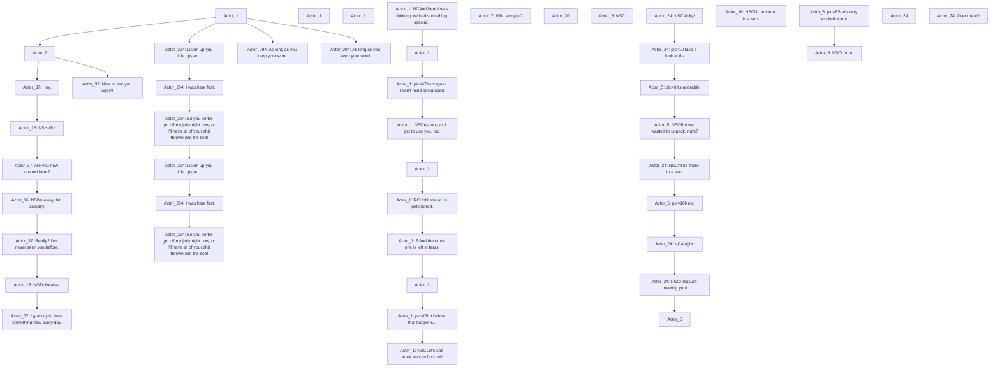

# Characters/Lazar

```mermaid
graph TD
    49_0["Actor_1"]
    49_1["Actor_294: Listen up you little upstart..."]
    49_2["Actor_294: I was here first."]
    49_3["Actor_294: So you better get off my jetty right now, or I'll have all of your shit thrown into the sea!"]
    49_4["Actor_294: Listen up you little upstart..."]
    49_5["Actor_294: I was here first."]
    49_6["Actor_294: So you better get off my jetty right now, or I'll have all of your shit thrown into the sea!"]
    49_7["Actor_294: As long as you keep your word."]
    49_8["Actor_294: As long as you keep your word."]
    49_19["Actor_1"]
    49_26["Actor_1"]
    49_29["Actor_1: NCAnd here I was thinking we had something special..."]
    49_30["Actor_1"]
    49_31["Actor_1: pic=6Then again, I don't mind being used."]
    49_32["Actor_1: NSCAs long as I get to use you, too."]
    49_33["Actor_1"]
    49_34["Actor_1: pic=6But before that happens..."]
    49_36["Actor_1: NSCLet's see what we can find out!"]
    49_40["Actor_1: RCUntil one of us gets bored."]
    49_41["Actor_1: RAnd the other one is left in tears."]
    49_42["Actor_1"]
    49_75["Actor_7: Who are you?"]
    49_80["Actor_20"]
    49_83["Actor_9"]
    49_86["Actor_5: NSC"]
    49_88["Actor_5: NSCLorna."]
    49_90["Actor_24: NSCVicky!"]
    49_91["Actor_24: pic=10Take a look at th-"]
    49_92["Actor_5: pic=6It's adorable."]
    49_93["Actor_5: NSCBut we wanted to unpack, right?"]
    49_94["Actor_24: NSCI'll be there in a sec-"]
    49_95["Actor_5: pic=10Now."]
    49_96["Actor_16: NSCI'll be there in a sec-"]
    49_97["Actor_24: NCAlright."]
    49_98["Actor_24: NSCPleasure meeting you!"]
    49_102["Actor_5: pic=6She's very excited about "]
    49_104["Actor_24"]
    49_110["Actor_24: Over there?"]
    49_146["Actor_5"]
    49_149["Actor_37: Hey."]
    49_150["Actor_37: Nice to see you again!"]
    49_152["Actor_16: NSHello!"]
    49_153["Actor_37: Are you new around here?"]
    49_154["Actor_16: NSI'm a regular, actually."]
    49_155["Actor_37: Really? I've never seen you before."]
    49_156["Actor_16: NGDLikewise."]
    49_157["Actor_37: I guess you lean something new every day."]
    49_0 --> 49_83
    49_0 --> 49_1
    49_0 --> 49_7
    49_0 --> 49_8
    49_1 --> 49_2
    49_2 --> 49_3
    49_3 --> 49_4
    49_4 --> 49_5
    49_5 --> 49_6
    49_29 --> 49_30
    49_30 --> 49_31
    49_31 --> 49_32
    49_32 --> 49_33
    49_33 --> 49_40
    49_34 --> 49_36
    49_40 --> 49_41
    49_41 --> 49_42
    49_42 --> 49_34
    49_83 --> 49_149
    49_83 --> 49_150
    49_90 --> 49_91
    49_91 --> 49_92
    49_92 --> 49_93
    49_93 --> 49_94
    49_94 --> 49_95
    49_95 --> 49_97
    49_97 --> 49_98
    49_98 --> 49_146
    49_102 --> 49_88
    49_149 --> 49_152
    49_152 --> 49_153
    49_153 --> 49_154
    49_154 --> 49_155
    49_155 --> 49_156
    49_156 --> 49_157
```