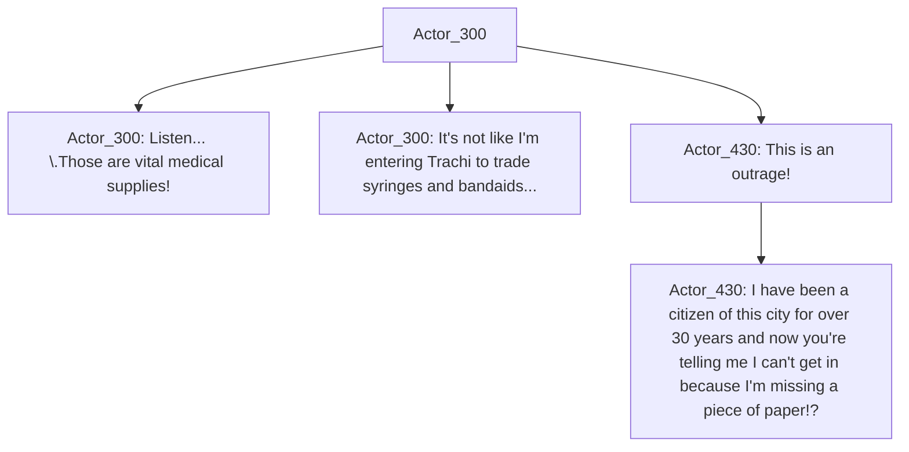

# Characters/Leontiy

```mermaid
graph TD
    298_0["Actor_300"]
    298_1["Actor_300: Listen... \.Those are vital medical supplies!"]
    298_2["Actor_300: It's not like I'm entering Trachi to trade syringes and bandaids..."]
    298_3["Actor_430: This is an outrage!"]
    298_4["Actor_430: I have been a citizen of this city for over 30 years and now you're telling me I can't get in because I'm missing a piece of paper!?"]
    298_0 --> 298_1
    298_0 --> 298_2
    298_0 --> 298_3
    298_3 --> 298_4
```