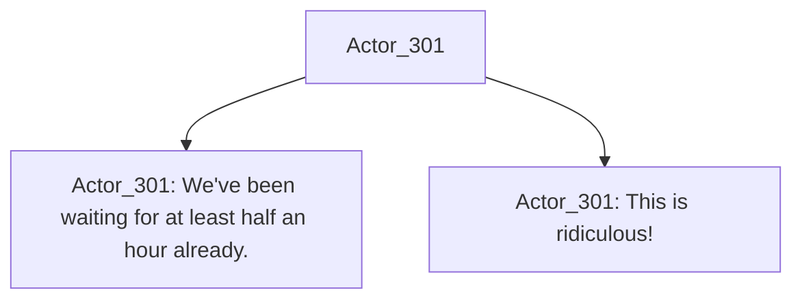

# Characters/Lera

```mermaid
graph TD
    299_0["Actor_301"]
    299_1["Actor_301: We've been waiting for at least half an hour already."]
    299_2["Actor_301: This is ridiculous!"]
    299_0 --> 299_1
    299_0 --> 299_2
```