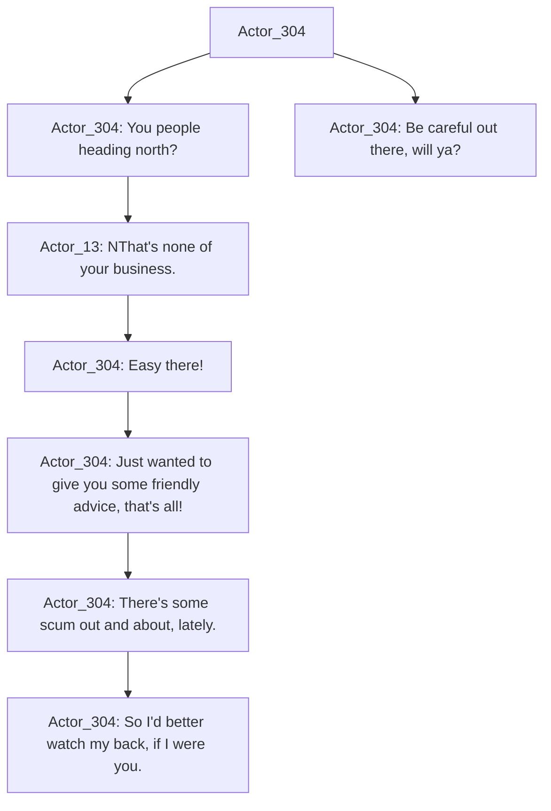

# Characters/Ljupčo

```mermaid
graph TD
    302_0["Actor_304"]
    302_1["Actor_304: You people heading north?"]
    302_2["Actor_13: NThat's none of your business."]
    302_3["Actor_304: Easy there!"]
    302_4["Actor_304: Just wanted to give you some friendly advice, that's all!"]
    302_5["Actor_304: There's some scum out and about, lately."]
    302_6["Actor_304: So I'd better watch my back, if I were you."]
    302_7["Actor_304: Be careful out there, will ya?"]
    302_0 --> 302_1
    302_0 --> 302_7
    302_1 --> 302_2
    302_2 --> 302_3
    302_3 --> 302_4
    302_4 --> 302_5
    302_5 --> 302_6
```