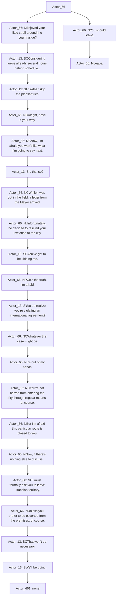

# Characters/Louis

```mermaid
graph TD
    303_0["Actor_66"]
    303_1["Actor_66: NEnjoyed your little stroll around the countryside?"]
    303_2["Actor_13: SCConsidering we're already several hours behind schedule..."]
    303_3["Actor_13: SI'd rather skip the pleasantries."]
    303_4["Actor_66: NCAlright, have it your way."]
    303_5["Actor_66: NCNow, I'm afraid you won't like what I'm going to say next."]
    303_6["Actor_13: SIs that so?"]
    303_7["Actor_66: NCWhile I was out in the field, a letter from the Mayor arrived."]
    303_8["Actor_66: NUnfortunately, he decided to rescind your invitation to the city."]
    303_9["Actor_10: SCYou've got to be kidding me."]
    303_10["Actor_66: NPCIt's the truth, I'm afraid."]
    303_11["Actor_13: SYou do realize you're violating an international agreement?"]
    303_12["Actor_66: NCWhatever the case might be."]
    303_13["Actor_66: NIt's out of my hands."]
    303_14["Actor_66: NCYou're not barred from entering the city through regular means, of course."]
    303_15["Actor_66: NBut I'm afraid this particular route is closed to you."]
    303_16["Actor_66: NNow, if there's nothing else to discuss..."]
    303_17["Actor_66: NCI must formally ask you to leave Trachian territory."]
    303_18["Actor_66: NUnless you prefer to be escorted from the premises, of course."]
    303_19["Actor_13: SCThat won't be necessary."]
    303_20["Actor_13: SWe'll be going."]
    303_21["Actor_461: none"]
    303_22["Actor_66: NYou should leave."]
    303_23["Actor_66: NLeave."]
    303_0 --> 303_1
    303_0 --> 303_22
    303_1 --> 303_2
    303_2 --> 303_3
    303_3 --> 303_4
    303_4 --> 303_5
    303_5 --> 303_6
    303_6 --> 303_7
    303_7 --> 303_8
    303_8 --> 303_9
    303_9 --> 303_10
    303_10 --> 303_11
    303_11 --> 303_12
    303_12 --> 303_13
    303_13 --> 303_14
    303_14 --> 303_15
    303_15 --> 303_16
    303_16 --> 303_17
    303_17 --> 303_18
    303_18 --> 303_19
    303_19 --> 303_20
    303_20 --> 303_21
    303_22 --> 303_23
```