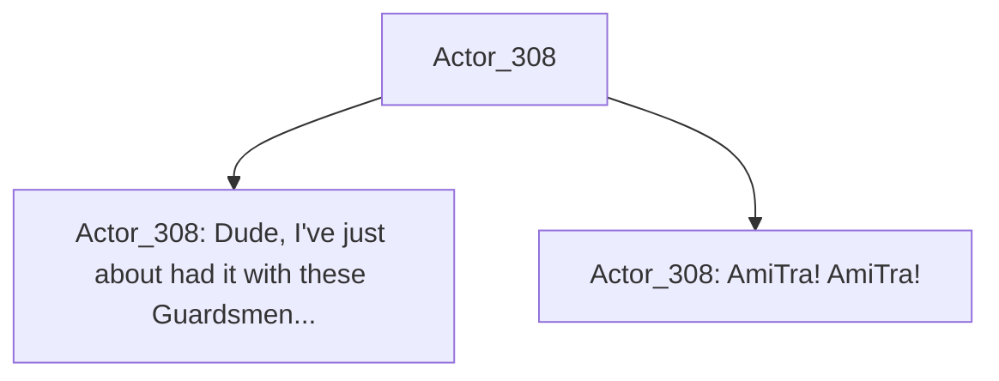

# Characters/Lykke

```mermaid
graph TD
    307_0["Actor_308"]
    307_1["Actor_308: Dude, I've just about had it with these Guardsmen..."]
    307_2["Actor_308: AmiTra! AmiTra!"]
    307_0 --> 307_1
    307_0 --> 307_2
```