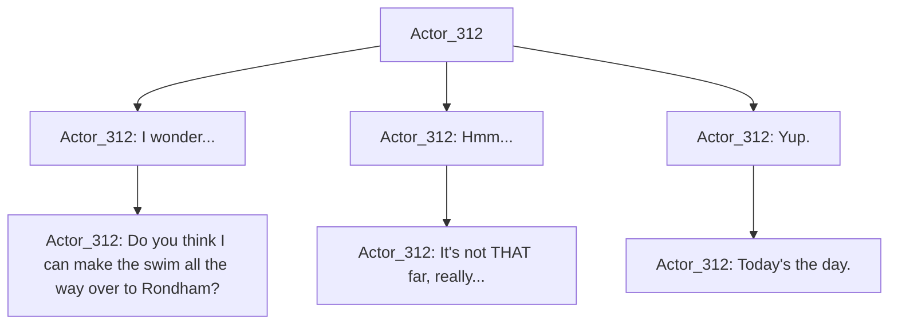

# Characters/Manuel

```mermaid
graph TD
    311_0["Actor_312"]
    311_1["Actor_312: I wonder..."]
    311_2["Actor_312: Do you think I can make the swim all the way over to Rondham?"]
    311_3["Actor_312: Hmm..."]
    311_4["Actor_312: It's not THAT far, really..."]
    311_5["Actor_312: Yup."]
    311_6["Actor_312: Today's the day."]
    311_0 --> 311_1
    311_0 --> 311_3
    311_0 --> 311_5
    311_1 --> 311_2
    311_3 --> 311_4
    311_5 --> 311_6
```