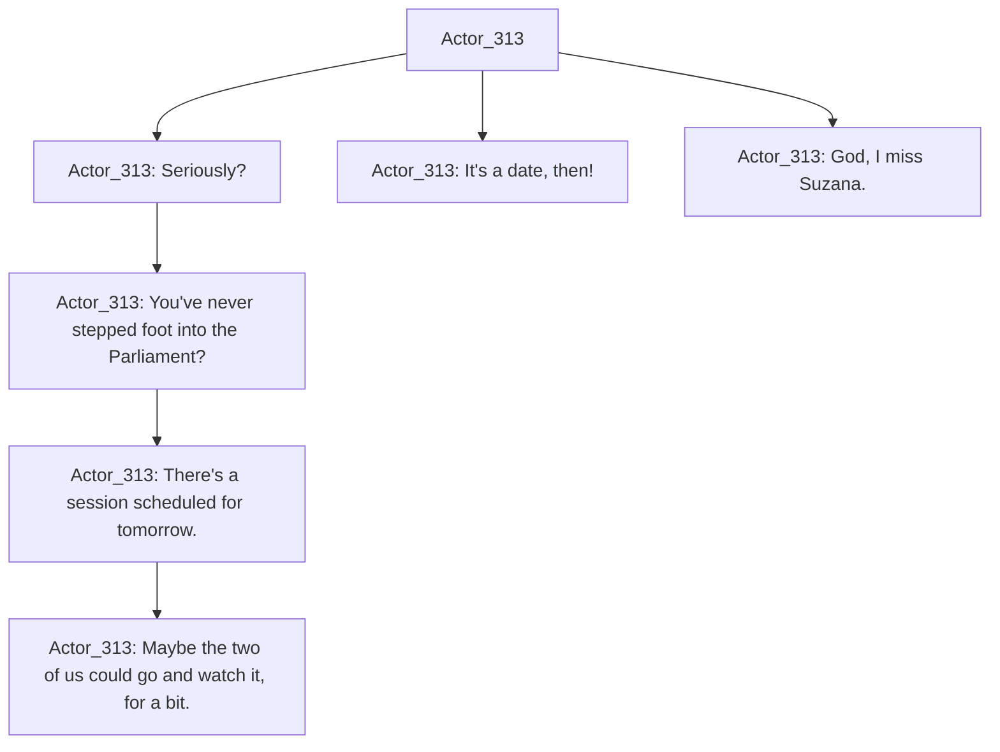

# Characters/Marcelinho

```mermaid
graph TD
    312_0["Actor_313"]
    312_1["Actor_313: Seriously?"]
    312_2["Actor_313: You've never stepped foot into the Parliament?"]
    312_3["Actor_313: There's a session scheduled for tomorrow."]
    312_4["Actor_313: Maybe the two of us could go and watch it, for a bit."]
    312_5["Actor_313: It's a date, then!"]
    312_6["Actor_313: God, I miss Suzana."]
    312_0 --> 312_1
    312_0 --> 312_5
    312_0 --> 312_6
    312_1 --> 312_2
    312_2 --> 312_3
    312_3 --> 312_4
```