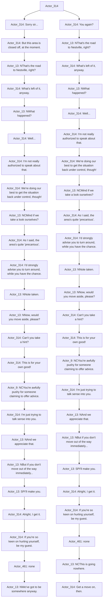

# Characters/Marcus

```mermaid
graph TD
    313_0["Actor_314"]
    313_1["Actor_314: Sorry sir..."]
    313_2["Actor_314: But this area is closed off, at the moment."]
    313_3["Actor_13: NThat's the road to Nestville, right?"]
    313_4["Actor_314: What's left of it, anyway."]
    313_5["Actor_13: NWhat happened?"]
    313_6["Actor_314: Well..."]
    313_7["Actor_314: I'm not really authorized to speak about that."]
    313_8["Actor_314: We're doing our best to get the situation back under control, though!"]
    313_9["Actor_13: NCMind if we take a look ourselves?"]
    313_10["Actor_314: As I said, the area's quite 'precarious'."]
    313_11["Actor_314: I'd strongly advise you to turn around, while you have the chance."]
    313_12["Actor_13: NNote taken."]
    313_13["Actor_13: NNow, would you move aside, please?"]
    313_14["Actor_314: Can't you take a hint?"]
    313_15["Actor_314: This is for your own good!"]
    313_16["Actor_9: NCYou're awfully pushy for someone claiming to offer advice."]
    313_17["Actor_314: I'm just trying to talk sense into you."]
    313_18["Actor_13: NAnd we appreciate that."]
    313_19["Actor_13: NBut if you don't move out of the way immediately..."]
    313_20["Actor_13: SPI'll make you."]
    313_21["Actor_314: Alright, I get it."]
    313_22["Actor_314: If you're so keen on hurting yourself, be my guest."]
    313_23["Actor_461: none"]
    313_24["Actor_13: NWe've got to be somewhere anyway."]
    313_25["Actor_314: You again?"]
    313_26["Actor_13: NThat's the road to Nestville, right?"]
    313_27["Actor_314: What's left of it, anyway."]
    313_28["Actor_13: NWhat happened?"]
    313_29["Actor_314: Well..."]
    313_30["Actor_314: I'm not really authorized to speak about that."]
    313_31["Actor_314: We're doing our best to get the situation back under control, though!"]
    313_32["Actor_13: NCMind if we take a look ourselves?"]
    313_33["Actor_314: As I said, the area's quite 'precarious'."]
    313_34["Actor_314: I'd strongly advise you to turn around, while you have the chance."]
    313_35["Actor_13: NNote taken."]
    313_36["Actor_13: NNow, would you move aside, please?"]
    313_37["Actor_314: Can't you take a hint?"]
    313_38["Actor_314: This is for your own good!"]
    313_39["Actor_9: NCYou're awfully pushy for someone claiming to offer advice."]
    313_40["Actor_314: I'm just trying to talk sense into you."]
    313_41["Actor_13: NAnd we appreciate that."]
    313_42["Actor_13: NBut if you don't move out of the way immediately..."]
    313_43["Actor_13: SPI'll make you."]
    313_44["Actor_314: Alright, I get it."]
    313_45["Actor_314: If you're so keen on hurting yourself, be my guest."]
    313_46["Actor_461: none"]
    313_47["Actor_13: NCThis is going nowhere."]
    313_48["Actor_314: Get a move on, then."]
    313_0 --> 313_1
    313_0 --> 313_25
    313_1 --> 313_2
    313_2 --> 313_3
    313_3 --> 313_4
    313_4 --> 313_5
    313_5 --> 313_6
    313_6 --> 313_7
    313_7 --> 313_8
    313_8 --> 313_9
    313_9 --> 313_10
    313_10 --> 313_11
    313_11 --> 313_12
    313_12 --> 313_13
    313_13 --> 313_14
    313_14 --> 313_15
    313_15 --> 313_16
    313_16 --> 313_17
    313_17 --> 313_18
    313_18 --> 313_19
    313_19 --> 313_20
    313_20 --> 313_21
    313_21 --> 313_22
    313_22 --> 313_23
    313_23 --> 313_24
    313_25 --> 313_26
    313_26 --> 313_27
    313_27 --> 313_28
    313_28 --> 313_29
    313_29 --> 313_30
    313_30 --> 313_31
    313_31 --> 313_32
    313_32 --> 313_33
    313_33 --> 313_34
    313_34 --> 313_35
    313_35 --> 313_36
    313_36 --> 313_37
    313_37 --> 313_38
    313_38 --> 313_39
    313_39 --> 313_40
    313_40 --> 313_41
    313_41 --> 313_42
    313_42 --> 313_43
    313_43 --> 313_44
    313_44 --> 313_45
    313_45 --> 313_46
    313_46 --> 313_47
    313_47 --> 313_48
```