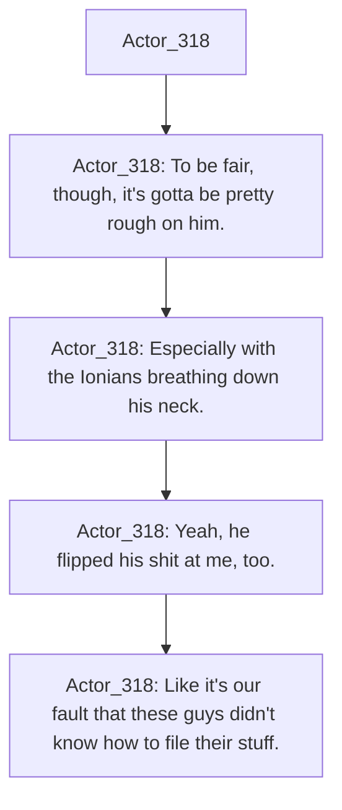

# Characters/Marinos

```mermaid
graph TD
    317_0["Actor_318"]
    317_1["Actor_318: To be fair, though, it's gotta be pretty rough on him."]
    317_2["Actor_318: Especially with the Ionians breathing down his neck."]
    317_3["Actor_318: Yeah, he flipped his shit at me, too."]
    317_4["Actor_318: Like it's our fault that these guys didn't know how to file their stuff."]
    317_0 --> 317_1
    317_1 --> 317_2
    317_2 --> 317_3
    317_3 --> 317_4
```