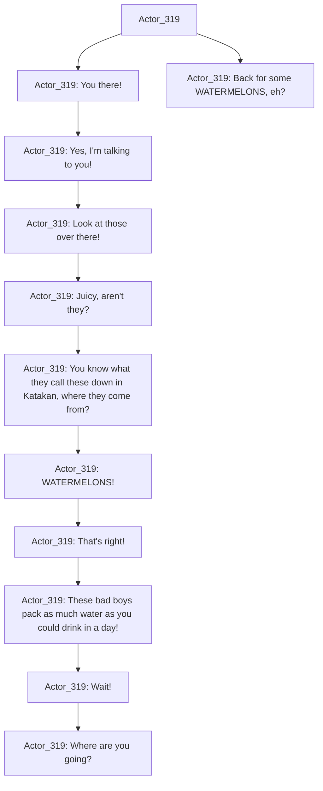

# Characters/Marisa

```mermaid
graph TD
    318_0["Actor_319"]
    318_1["Actor_319: You there!"]
    318_2["Actor_319: Yes, I'm talking to you!"]
    318_3["Actor_319: Look at those over there!"]
    318_4["Actor_319: Juicy, aren't they?"]
    318_5["Actor_319: You know what they call these down in Katakan, where they come from?"]
    318_6["Actor_319: WATERMELONS!"]
    318_7["Actor_319: That's right!"]
    318_8["Actor_319: These bad boys pack as much water as you could drink in a day!"]
    318_9["Actor_319: Wait!"]
    318_10["Actor_319: Where are you going?"]
    318_11["Actor_319: Back for some WATERMELONS, eh?"]
    318_0 --> 318_1
    318_0 --> 318_11
    318_1 --> 318_2
    318_2 --> 318_3
    318_3 --> 318_4
    318_4 --> 318_5
    318_5 --> 318_6
    318_6 --> 318_7
    318_7 --> 318_8
    318_8 --> 318_9
    318_9 --> 318_10
```