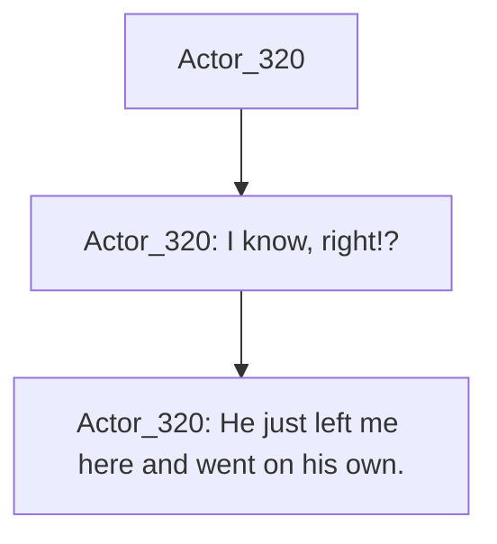

# Characters/Mariyka

```mermaid
graph TD
    319_0["Actor_320"]
    319_1["Actor_320: I know, right!?"]
    319_2["Actor_320: He just left me here and went on his own."]
    319_0 --> 319_1
    319_1 --> 319_2
```