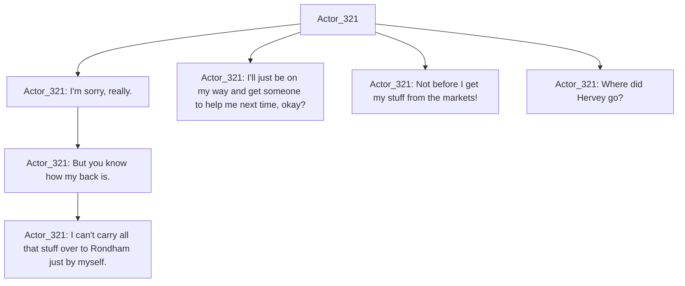

# Characters/Mark

```mermaid
graph TD
    320_0["Actor_321"]
    320_1["Actor_321: I'm sorry, really."]
    320_2["Actor_321: But you know how my back is."]
    320_3["Actor_321: I can't carry all that stuff over to Rondham just by myself."]
    320_4["Actor_321: I'll just be on my way and get someone to help me next time, okay?"]
    320_5["Actor_321: Not before I get my stuff from the markets!"]
    320_6["Actor_321: Where did Hervey go?"]
    320_0 --> 320_1
    320_0 --> 320_4
    320_0 --> 320_5
    320_0 --> 320_6
    320_1 --> 320_2
    320_2 --> 320_3
```