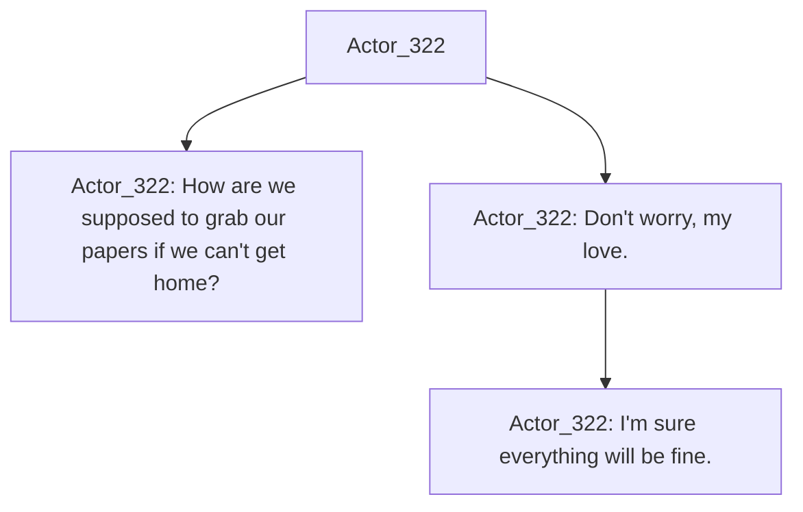

# Characters/Markos

```mermaid
graph TD
    321_0["Actor_322"]
    321_1["Actor_322: How are we supposed to grab our papers if we can't get home?"]
    321_2["Actor_322: Don't worry, my love."]
    321_3["Actor_322: I'm sure everything will be fine."]
    321_0 --> 321_1
    321_0 --> 321_2
    321_2 --> 321_3
```