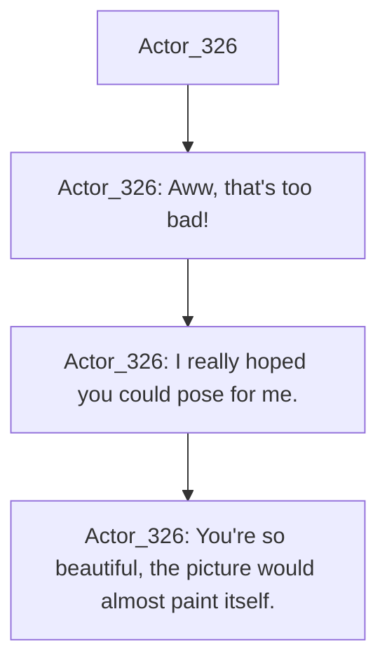

# Characters/Martí

```mermaid
graph TD
    325_0["Actor_326"]
    325_1["Actor_326: Aww, that's too bad!"]
    325_2["Actor_326: I really hoped you could pose for me."]
    325_3["Actor_326: You're so beautiful, the picture would almost paint itself."]
    325_0 --> 325_1
    325_1 --> 325_2
    325_2 --> 325_3
```