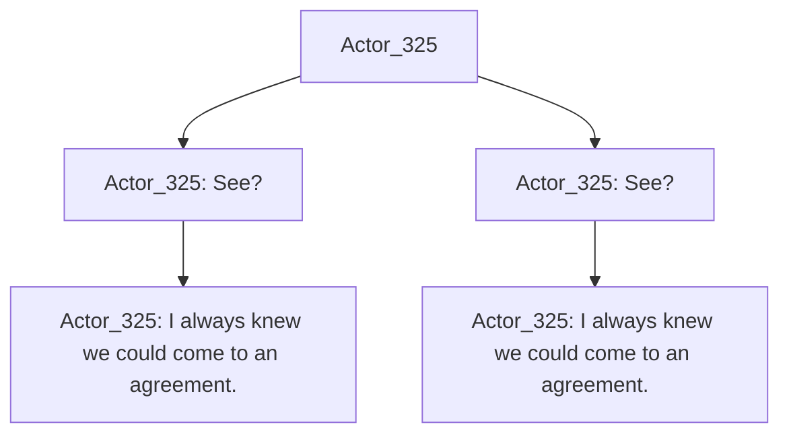

# Characters/Martin

```mermaid
graph TD
    324_0["Actor_325"]
    324_1["Actor_325: See?"]
    324_2["Actor_325: I always knew we could come to an agreement."]
    324_3["Actor_325: See?"]
    324_4["Actor_325: I always knew we could come to an agreement."]
    324_0 --> 324_1
    324_0 --> 324_3
    324_1 --> 324_2
    324_3 --> 324_4
```