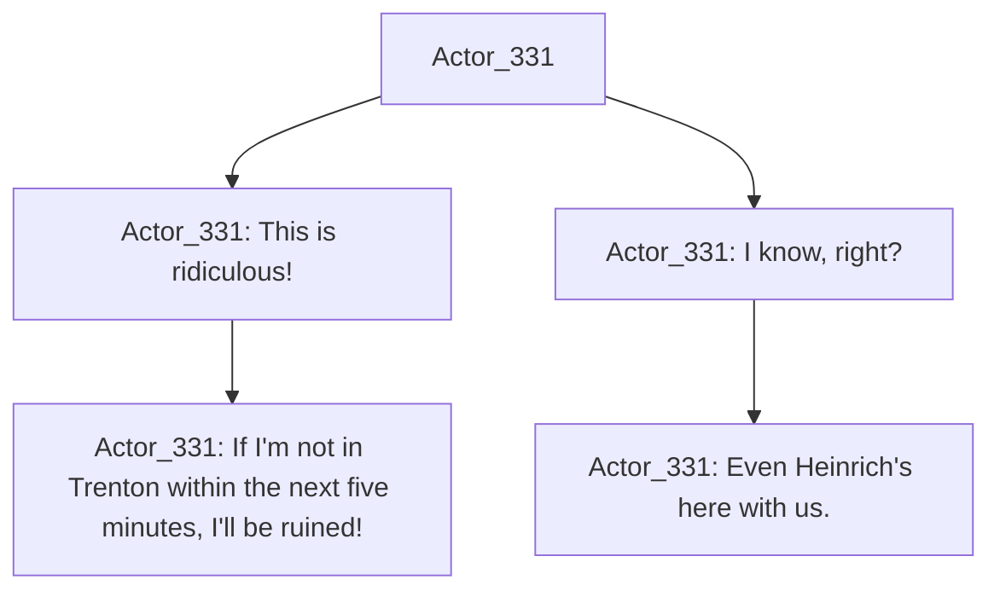

# Characters/Michael

```mermaid
graph TD
    329_0["Actor_331"]
    329_1["Actor_331: This is ridiculous!"]
    329_2["Actor_331: If I'm not in Trenton within the next five minutes, I'll be ruined!"]
    329_3["Actor_331: I know, right?"]
    329_4["Actor_331: Even Heinrich's here with us."]
    329_0 --> 329_1
    329_0 --> 329_3
    329_1 --> 329_2
    329_3 --> 329_4
```