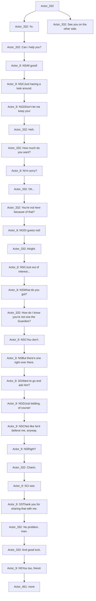

# Characters/Mihail

```mermaid
graph TD
    330_0["Actor_332"]
    330_1["Actor_332: Yo."]
    330_2["Actor_332: Can I help you?"]
    330_3["Actor_9: NSAll good!"]
    330_4["Actor_9: NSCJust having a look around."]
    330_5["Actor_9: NGDDon't let me keep you!"]
    330_6["Actor_332: Heh."]
    330_7["Actor_332: How much do you want?"]
    330_8["Actor_9: NI'm sorry?"]
    330_9["Actor_332: Oh..."]
    330_10["Actor_332: You're not here because of that?"]
    330_11["Actor_9: NGDI guess not!"]
    330_12["Actor_332: Alright."]
    330_13["Actor_9: NSCJust out of interest..."]
    330_14["Actor_9: NSWhat do you got?"]
    330_15["Actor_332: How do I know you're not one the Guardies?"]
    330_16["Actor_9: NSCYou don't."]
    330_17["Actor_9: NSBut there's one right over there."]
    330_18["Actor_9: SGWant to go and ask him?"]
    330_19["Actor_9: NGDJust kidding, of course!"]
    330_20["Actor_9: NSCNot like he'd believe me, anyway."]
    330_21["Actor_9: NSRight?"]
    330_22["Actor_332: Chario."]
    330_23["Actor_9: SCI see."]
    330_24["Actor_9: SSThank you for sharing that with me."]
    330_25["Actor_332: No problem, man."]
    330_26["Actor_332: And good luck."]
    330_27["Actor_9: NSYou too, friend."]
    330_28["Actor_461: none"]
    330_29["Actor_332: See you on the other side."]
    330_0 --> 330_1
    330_0 --> 330_29
    330_1 --> 330_2
    330_2 --> 330_3
    330_3 --> 330_4
    330_4 --> 330_5
    330_5 --> 330_6
    330_6 --> 330_7
    330_7 --> 330_8
    330_8 --> 330_9
    330_9 --> 330_10
    330_10 --> 330_11
    330_11 --> 330_12
    330_12 --> 330_13
    330_13 --> 330_14
    330_14 --> 330_15
    330_15 --> 330_16
    330_16 --> 330_17
    330_17 --> 330_18
    330_18 --> 330_19
    330_19 --> 330_20
    330_20 --> 330_21
    330_21 --> 330_22
    330_22 --> 330_23
    330_23 --> 330_24
    330_24 --> 330_25
    330_25 --> 330_26
    330_26 --> 330_27
    330_27 --> 330_28
```