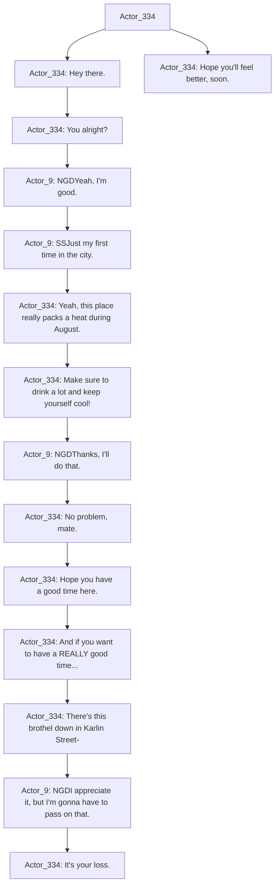

# Characters/Milen

```mermaid
graph TD
    332_0["Actor_334"]
    332_1["Actor_334: Hey there."]
    332_2["Actor_334: You alright?"]
    332_3["Actor_9: NGDYeah, I'm good."]
    332_4["Actor_9: SSJust my first time in the city."]
    332_5["Actor_334: Yeah, this place really packs a heat during August."]
    332_6["Actor_334: Make sure to drink a lot and keep yourself cool!"]
    332_7["Actor_9: NGDThanks, I'll do that."]
    332_8["Actor_334: No problem, mate."]
    332_9["Actor_334: Hope you have a good time here."]
    332_10["Actor_334: And if you want to have a REALLY good time..."]
    332_11["Actor_334: There's this brothel down in Karlin Street-"]
    332_12["Actor_9: NGDI appreciate it, but I'm gonna have to pass on that."]
    332_13["Actor_334: It's your loss."]
    332_14["Actor_334: Hope you'll feel better, soon."]
    332_0 --> 332_1
    332_0 --> 332_14
    332_1 --> 332_2
    332_2 --> 332_3
    332_3 --> 332_4
    332_4 --> 332_5
    332_5 --> 332_6
    332_6 --> 332_7
    332_7 --> 332_8
    332_8 --> 332_9
    332_9 --> 332_10
    332_10 --> 332_11
    332_11 --> 332_12
    332_12 --> 332_13
```