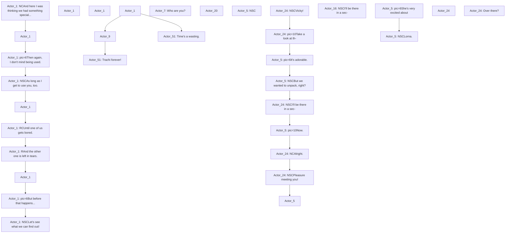

# Characters/Miloslav

```mermaid
graph TD
    73_0["Actor_1"]
    73_1["Actor_51: Time's a wasting."]
    73_19["Actor_1"]
    73_26["Actor_1"]
    73_29["Actor_1: NCAnd here I was thinking we had something special..."]
    73_30["Actor_1"]
    73_31["Actor_1: pic=6Then again, I don't mind being used."]
    73_32["Actor_1: NSCAs long as I get to use you, too."]
    73_33["Actor_1"]
    73_34["Actor_1: pic=6But before that happens..."]
    73_36["Actor_1: NSCLet's see what we can find out!"]
    73_40["Actor_1: RCUntil one of us gets bored."]
    73_41["Actor_1: RAnd the other one is left in tears."]
    73_42["Actor_1"]
    73_75["Actor_7: Who are you?"]
    73_80["Actor_20"]
    73_83["Actor_9"]
    73_86["Actor_5: NSC"]
    73_88["Actor_5: NSCLorna."]
    73_90["Actor_24: NSCVicky!"]
    73_91["Actor_24: pic=10Take a look at th-"]
    73_92["Actor_5: pic=6It's adorable."]
    73_93["Actor_5: NSCBut we wanted to unpack, right?"]
    73_94["Actor_24: NSCI'll be there in a sec-"]
    73_95["Actor_5: pic=10Now."]
    73_96["Actor_16: NSCI'll be there in a sec-"]
    73_97["Actor_24: NCAlright."]
    73_98["Actor_24: NSCPleasure meeting you!"]
    73_102["Actor_5: pic=6She's very excited about "]
    73_104["Actor_24"]
    73_110["Actor_24: Over there?"]
    73_146["Actor_5"]
    73_149["Actor_51: Trachi forever!"]
    73_0 --> 73_83
    73_0 --> 73_1
    73_29 --> 73_30
    73_30 --> 73_31
    73_31 --> 73_32
    73_32 --> 73_33
    73_33 --> 73_40
    73_34 --> 73_36
    73_40 --> 73_41
    73_41 --> 73_42
    73_42 --> 73_34
    73_83 --> 73_149
    73_90 --> 73_91
    73_91 --> 73_92
    73_92 --> 73_93
    73_93 --> 73_94
    73_94 --> 73_95
    73_95 --> 73_97
    73_97 --> 73_98
    73_98 --> 73_146
    73_102 --> 73_88
```