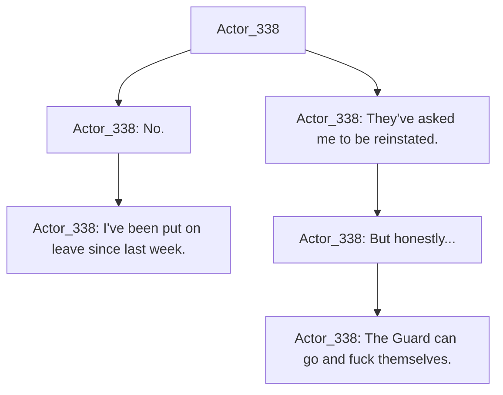

# Characters/Mirko

```mermaid
graph TD
    337_0["Actor_338"]
    337_1["Actor_338: No."]
    337_2["Actor_338: I've been put on leave since last week."]
    337_3["Actor_338: They've asked me to be reinstated."]
    337_4["Actor_338: But honestly..."]
    337_5["Actor_338: The Guard can go and fuck themselves."]
    337_0 --> 337_1
    337_0 --> 337_3
    337_1 --> 337_2
    337_3 --> 337_4
    337_4 --> 337_5
```