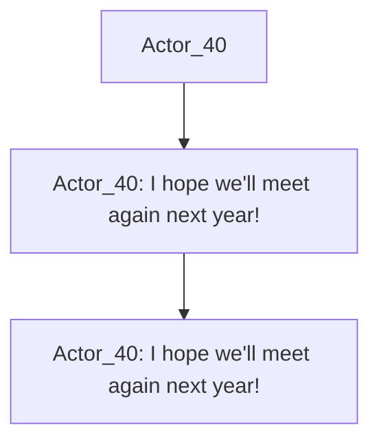

# Characters/Miron

```mermaid
graph TD
    338_0["Actor_40"]
    338_1["Actor_40: I hope we'll meet again next year!"]
    338_2["Actor_40: I hope we'll meet again next year!"]
    338_0 --> 338_1
    338_1 --> 338_2
```