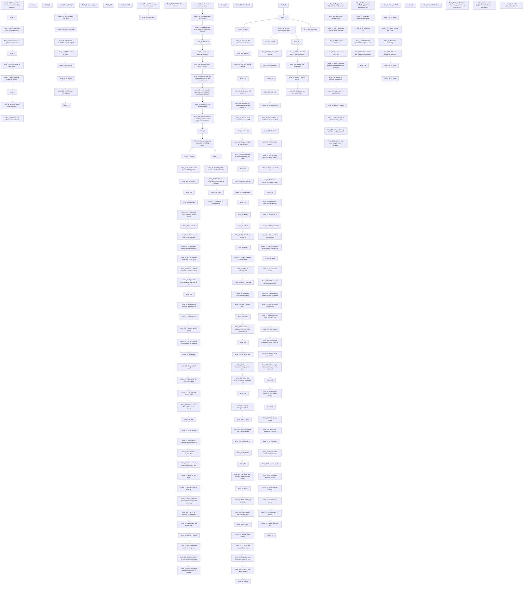

# Characters/Miroslav

```mermaid
graph TD
    51_0["Actor_1"]
    51_19["Actor_1"]
    51_26["Actor_1"]
    51_29["Actor_1: NCAnd here I was thinking we had something special..."]
    51_30["Actor_1"]
    51_31["Actor_1: pic=6Then again, I don't mind being used."]
    51_32["Actor_1: NSCAs long as I get to use you, too."]
    51_33["Actor_1"]
    51_34["Actor_1: pic=6But before that happens..."]
    51_36["Actor_1: NSCLet's see what we can find out!"]
    51_40["Actor_1: RCUntil one of us gets bored."]
    51_41["Actor_1: RAnd the other one is left in tears."]
    51_42["Actor_1"]
    51_75["Actor_7: Who are you?"]
    51_80["Actor_20"]
    51_83["Actor_16"]
    51_86["Actor_5: NSC"]
    51_88["Actor_5: NSCLorna."]
    51_90["Actor_24: NSCVicky!"]
    51_91["Actor_24: pic=10Take a look at th-"]
    51_92["Actor_5: pic=6It's adorable."]
    51_93["Actor_5: NSCBut we wanted to unpack, right?"]
    51_94["Actor_24: NSCI'll be there in a sec-"]
    51_95["Actor_5: pic=10Now."]
    51_96["Actor_16: NSCI'll be there in a sec-"]
    51_97["Actor_24: NCAlright."]
    51_98["Actor_24: NSCPleasure meeting you!"]
    51_102["Actor_5: pic=6She's very excited about "]
    51_104["Actor_24"]
    51_110["Actor_24: Over there?"]
    51_146["Actor_5"]
    51_149["Actor_33: Hey!"]
    51_150["Actor_33: Stay sharp."]
    51_160["Actor_16: NSA bit."]
    51_161["Actor_33: You look like you've been around."]
    51_162["Actor_33: Don't tell anyone I asked."]
    51_163["Actor_33: Is Georgios still out there?"]
    51_164["Actor_16: NSYeah! He's keeping tabs on who's coming in."]
    51_165["Actor_33: Did he run a check on you as well?"]
    51_169["Actor_16: NSHe did!"]
    51_170["Actor_16: NGDAll thanks to this little bad boy right here!"]
    51_173["Actor_33: I'm sworn to secrecy, sorry!"]
    51_175["Actor_33: I'll make it up to you, though!"]
    51_176["Actor_33: There's an old book, a relic or something like that."]
    51_177["Actor_16: RA relic?"]
    51_179["Actor_33: I don't know where it is exactly."]
    51_180["Actor_33: But if you find it, bring it to me."]
    51_181["Actor_16: NGDSounds like you're asking me for two favours now!"]
    51_182["Actor_33: Look, I couldn't give less of a shit about some boring old book."]
    51_183["Actor_33: Except for the fact that it's old."]
    51_184["Actor_33: Maybe we'll find something out about the way things used to be."]
    51_185["Actor_16"]
    51_186["Actor_33: I'm guessing you know what I'm talking about."]
    51_187["Actor_7: IONIA"]
    51_188["Actor_16: Is that the book you're talking about?"]
    51_189["Actor_16: Fine, I'll get back to you if I find something."]
    51_190["Actor_33: Thanks. And remember: Not a word to anyone."]
    51_191["Actor_16: Sure."]
    51_192["Actor_33: Thank you for understanding."]
    51_193["Actor_33: Let me see."]
    51_194["Actor_16"]
    51_195["Actor_33: Holy hell."]
    51_196["Actor_33: It's been ages since I've seen one of those!"]
    51_197["Actor_16: You too?"]
    51_198["Actor_33: Yeah, we had to read these at school."]
    51_199["Actor_33: Whole load of rubbish and propaganda."]
    51_200["Actor_33: But you already knew that, didn't you?"]
    51_201["Actor_16: I know it meant the world to a lot of people."]
    51_202["Actor_33: I guess it depends what you make of it."]
    51_203["Actor_16"]
    51_204["Actor_33: Either way, I think I've seen enough."]
    51_205["Actor_33: There you go."]
    51_206["Actor_16: You don't want to keep it?"]
    51_207["Actor_33: Hell no! This shit is considered contraband."]
    51_209["Actor_33: Oh, you don't know?"]
    51_210["Actor_16: By whom?"]
    51_211["Actor_33: The viceroyal and his crew."]
    51_212["Actor_7: ..."]
    51_213["Actor_16: NCI wouldn't be asking otherwise."]
    51_214["Actor_33: They've got an office right across the street."]
    51_215["Actor_16: Huh."]
    51_216["Actor_33: Don't tell me."]
    51_217["Actor_33: They've also boarded themselves up?"]
    51_218["Actor_33: Jeez. Humanity really screwed that one."]
    51_219["Actor_16: I didn't see anyone about."]
    51_220["Actor_16: What do you mean?"]
    51_221["Actor_33: Just my opinion, that's all."]
    51_222["Actor_33: Think I've taken up more than enough time, either way."]
    51_223["Actor_33: Thanks for showing me the book."]
    51_224["Actor_33: I appreciate the trust and all."]
    51_225["Actor_16: pic=6It's alright."]
    51_226["Actor_16: NSCI learned a couple of things, too!"]
    51_227["Actor_33: Great! Let's keep them to ourselves for now."]
    51_228["Actor_33: Until there's an opportunity to make a change."]
    51_229["Actor_33: You got something for me?"]
    51_230["Actor_7: IONIA"]
    51_231["Actor_16: NSLook what I found!"]
    51_232["Actor_16: NSI'll get back to you if I find something."]
    51_233["Actor_33: Thanks. And remember-"]
    51_234["Actor_16: NSNot a word to anyone."]
    51_235["Actor_33: Glad we're on the same page."]
    51_236["Actor_33: Let me see."]
    51_237["Actor_16"]
    51_238["Actor_33: Holy hell."]
    51_239["Actor_33: It's been ages!"]
    51_240["Actor_16: Did you have to read them at school, too?"]
    51_241["Actor_33: You bet!"]
    51_242["Actor_33: Whole load of rubbish."]
    51_243["Actor_33: But I guess it kept our people straight."]
    51_244["Actor_16: Even if it's made-up?"]
    51_245["Actor_33: Just makes it harder to prove it wrong."]
    51_246["Actor_16"]
    51_247["Actor_33: Either way, I think I've seen enough."]
    51_248["Actor_33: There you go."]
    51_249["Actor_16: NSAre you sure?"]
    51_250["Actor_33: Hell no! This shit is considered contraband."]
    51_251["Actor_33: Oh, you don't know?"]
    51_252["Actor_16: Is it?"]
    51_253["Actor_33: The pragmatic decree banned mythology."]
    51_254["Actor_7: ..."]
    51_255["Actor_16: NGDI wouldn't be asking otherwise!"]
    51_256["Actor_33: Funny, isn't it?"]
    51_257["Actor_16: That counts as mythology?"]
    51_258["Actor_33: It's full of Titans, Gods and what not."]
    51_259["Actor_33: They've also boarded themselves up?"]
    51_260["Actor_33: Jeez. Humanity really screwed that one."]
    51_261["Actor_16: I didn't see anyone about."]
    51_262["Actor_16: What do you mean?"]
    51_263["Actor_33: Just my opinion, that's all."]
    51_264["Actor_33: Think I've taken up more than enough time, either way."]
    51_265["Actor_33: Thanks for showing me the book."]
    51_266["Actor_33: I appreciate the trust and all."]
    51_267["Actor_16: pic=6It's alright."]
    51_268["Actor_16: NSCI learned a couple of things, too!"]
    51_269["Actor_33: Great! Let's keep them to ourselves for now."]
    51_270["Actor_33: Until there's an opportunity to make a change."]
    51_271["Actor_33: I'm guessing he let you through?"]
    51_272["Actor_33: Unit 5? That's..."]
    51_273["Actor_16"]
    51_274["Actor_16: RHey."]
    51_275["Actor_33: What?"]
    51_276["Actor_16: RAre you serving too?"]
    51_278["Actor_16: NSIrregulars."]
    51_279["Actor_16"]
    51_280["Actor_33: I guess there's a lot of memories."]
    51_281["Actor_33: Because not everybody appreciates their memories."]
    51_282["Actor_16: NCThat's too bad."]
    51_283["Actor_33: Not everybody appreciates a bit of history."]
    51_284["Actor_33"]
    51_285["Actor_33: Especially uncomfortable ones."]
    51_286["Actor_16: I think these people need to grow a pair."]
    51_287["Actor_16: Your hands are trembling."]
    51_289["Actor_33: Right."]
    51_291["Actor_33: Sergeant Kaloyanchev, Unit 4."]
    51_293["Actor_33: We punched a hundred-thousand shells into Kenovice."]
    51_294["Actor_16"]
    51_297["Actor_16: NCTough stuff."]
    51_299["Actor_33: Then I saw what's left of the people we hit."]
    51_300["Actor_33: In fact, I think we owe it to remember."]
    51_301["Actor_16: NSRight!"]
    51_304["Actor_33: That being said, I wouldn't wave your card around."]
    51_306["Actor_16"]
    51_307["Actor_16: Why?"]
    51_309["Actor_16: NSSure, I'd be delighted to!"]
    51_310["Actor_33: Great!"]
    51_311["Actor_33: I'll gladly talk history all day long."]
    51_312["Actor_16: NCSorry I brought that back."]
    51_313["Actor_33: It's okay."]
    51_314["Actor_33: Even if it hurts."]
    51_315["Actor_16: That's artillery, isn't it?"]
    51_316["Actor_16"]
    51_317["Actor_33: If you find more souvenirs, bring 'em here."]
    51_318["Actor_33: Yeah."]
    51_319["Actor_33: Unit 5? That's..."]
    51_320["Actor_33: If you find other souvenirs, you can bring them to me."]
    51_321["Actor_16: NCI guess."]
    51_322["Actor_33: Hard to blame you for that."]
    51_323["Actor_33: But as long as other people care, there's value in it."]
    51_325["Actor_16: NGDMaybe that's why I never cared for it."]
    51_327["Actor_33: I had the howitzers in my ears for days."]
    51_330["Actor_33: Folks are trying to forget."]
    51_331["Actor_33: Especially the ones that left Ionia."]
    51_332["Actor_16: NCI see."]
    51_333["Actor_33: Tell you what, though!"]
    51_334["Actor_16"]
    51_335["Actor_33"]
    51_336["Actor_33"]
    51_337["Actor_16: NSYou can keep it, if you want."]
    51_338["Actor_33: Hyperion's pragmatic decree banned mythology."]
    51_340["Actor_16: SCYeah."]
    51_341["Actor_16: SI think I know that name."]
    51_342["Actor_33: That's not surprising."]
    51_343["Actor_33: He's the chancellor, after all."]
    51_344["Actor_16: SCI see."]
    51_345["Actor_33: He's our chancellor, after all."]
    51_346["Actor_16: SCI see."]
    51_347["Actor_16"]
    51_348["Actor_33: Speaking of, here's our new line of thought."]
    51_349["Actor_16: NWIs that a crown?"]
    51_350["Actor_33: 'In NIONIA, everybody's royalty.'"]
    51_351["Actor_16: NCBig words."]
    51_353["Actor_16: NGDBut the crown is kinda cute!"]
    51_355["Actor_33: Do you want it?"]
    51_356["Actor_16: NSI couldn't possibly accept!"]
    51_357["Actor_33: No need to be humble."]
    51_358["Actor_33: It's the least I can do!"]
    51_359["Actor_16: NSThank you so much!"]
    51_360["Actor_33: Always happy to help."]
    51_361["Actor_33"]
    51_362["Actor_33: Back in the day."]
    51_0 --> 51_83
    51_29 --> 51_30
    51_30 --> 51_31
    51_31 --> 51_32
    51_32 --> 51_33
    51_33 --> 51_40
    51_34 --> 51_36
    51_40 --> 51_41
    51_41 --> 51_42
    51_42 --> 51_34
    51_83 --> 51_149
    51_83 --> 51_229
    51_83 --> 51_150
    51_90 --> 51_91
    51_91 --> 51_92
    51_92 --> 51_93
    51_93 --> 51_94
    51_94 --> 51_95
    51_95 --> 51_97
    51_97 --> 51_98
    51_98 --> 51_146
    51_102 --> 51_88
    51_149 --> 51_161
    51_160 --> 51_162
    51_161 --> 51_160
    51_162 --> 51_334
    51_163 --> 51_164
    51_164 --> 51_165
    51_165 --> 51_169
    51_169 --> 51_271
    51_170 --> 51_273
    51_173 --> 51_175
    51_175 --> 51_176
    51_176 --> 51_177
    51_177 --> 51_179
    51_179 --> 51_180
    51_180 --> 51_181
    51_181 --> 51_182
    51_182 --> 51_183
    51_183 --> 51_184
    51_184 --> 51_185
    51_185 --> 51_186
    51_186 --> 51_187
    51_186 --> 51_212
    51_187 --> 51_188
    51_188 --> 51_193
    51_189 --> 51_190
    51_190 --> 51_191
    51_191 --> 51_192
    51_193 --> 51_194
    51_194 --> 51_195
    51_195 --> 51_196
    51_196 --> 51_197
    51_197 --> 51_198
    51_198 --> 51_199
    51_199 --> 51_200
    51_200 --> 51_201
    51_201 --> 51_202
    51_202 --> 51_203
    51_203 --> 51_204
    51_204 --> 51_205
    51_205 --> 51_206
    51_206 --> 51_207
    51_207 --> 51_210
    51_209 --> 51_213
    51_210 --> 51_209
    51_211 --> 51_214
    51_212 --> 51_189
    51_213 --> 51_211
    51_214 --> 51_215
    51_215 --> 51_216
    51_216 --> 51_217
    51_217 --> 51_219
    51_218 --> 51_220
    51_219 --> 51_218
    51_220 --> 51_221
    51_221 --> 51_222
    51_222 --> 51_223
    51_223 --> 51_224
    51_224 --> 51_225
    51_225 --> 51_226
    51_226 --> 51_227
    51_227 --> 51_228
    51_229 --> 51_230
    51_229 --> 51_254
    51_230 --> 51_231
    51_231 --> 51_236
    51_232 --> 51_233
    51_233 --> 51_234
    51_234 --> 51_235
    51_236 --> 51_237
    51_237 --> 51_238
    51_238 --> 51_239
    51_239 --> 51_240
    51_240 --> 51_241
    51_241 --> 51_242
    51_242 --> 51_243
    51_243 --> 51_244
    51_244 --> 51_245
    51_245 --> 51_246
    51_246 --> 51_247
    51_247 --> 51_248
    51_248 --> 51_249
    51_249 --> 51_337
    51_250 --> 51_252
    51_251 --> 51_255
    51_252 --> 51_251
    51_253 --> 51_257
    51_254 --> 51_232
    51_255 --> 51_253
    51_256 --> 51_340
    51_257 --> 51_258
    51_258 --> 51_321
    51_259 --> 51_261
    51_260 --> 51_262
    51_261 --> 51_260
    51_262 --> 51_263
    51_263 --> 51_264
    51_264 --> 51_265
    51_265 --> 51_266
    51_266 --> 51_267
    51_267 --> 51_268
    51_268 --> 51_269
    51_269 --> 51_270
    51_271 --> 51_170
    51_272 --> 51_278
    51_273 --> 51_272
    51_274 --> 51_275
    51_275 --> 51_287
    51_276 --> 51_362
    51_278 --> 51_279
    51_279 --> 51_274
    51_280 --> 51_276
    51_281 --> 51_285
    51_282 --> 51_286
    51_283 --> 51_284
    51_285 --> 51_282
    51_286 --> 51_283
    51_287 --> 51_289
    51_289 --> 51_280
    51_291 --> 51_315
    51_293 --> 51_316
    51_297 --> 51_327
    51_299 --> 51_335
    51_300 --> 51_314
    51_301 --> 51_306
    51_304 --> 51_307
    51_306 --> 51_304
    51_307 --> 51_330
    51_309 --> 51_310
    51_311 --> 51_317
    51_312 --> 51_313
    51_313 --> 51_300
    51_314 --> 51_301
    51_315 --> 51_318
    51_316 --> 51_297
    51_317 --> 51_309
    51_318 --> 51_293
    51_321 --> 51_325
    51_322 --> 51_323
    51_323 --> 51_347
    51_325 --> 51_322
    51_327 --> 51_299
    51_330 --> 51_331
    51_331 --> 51_332
    51_332 --> 51_333
    51_333 --> 51_311
    51_334 --> 51_163
    51_335 --> 51_312
    51_336 --> 51_349
    51_337 --> 51_250
    51_340 --> 51_341
    51_341 --> 51_342
    51_342 --> 51_345
    51_344 --> 51_346
    51_345 --> 51_344
    51_347 --> 51_348
    51_348 --> 51_336
    51_349 --> 51_350
    51_350 --> 51_351
    51_351 --> 51_353
    51_353 --> 51_355
    51_355 --> 51_356
    51_356 --> 51_357
    51_357 --> 51_358
    51_358 --> 51_359
    51_359 --> 51_360
    51_360 --> 51_361
    51_362 --> 51_291
```