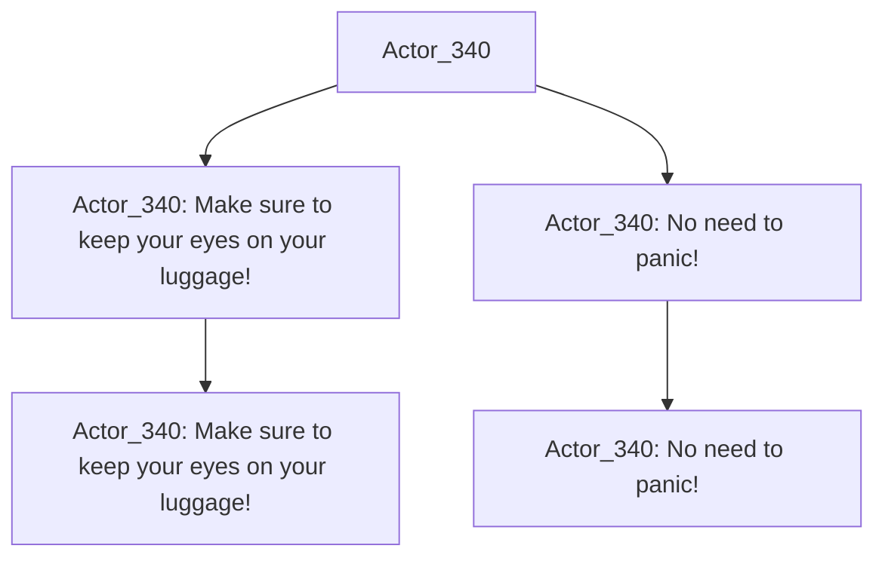

# Characters/Mojmír

```mermaid
graph TD
    340_0["Actor_340"]
    340_1["Actor_340: Make sure to keep your eyes on your luggage!"]
    340_2["Actor_340: Make sure to keep your eyes on your luggage!"]
    340_3["Actor_340: No need to panic!"]
    340_4["Actor_340: No need to panic!"]
    340_0 --> 340_1
    340_0 --> 340_3
    340_1 --> 340_2
    340_3 --> 340_4
```