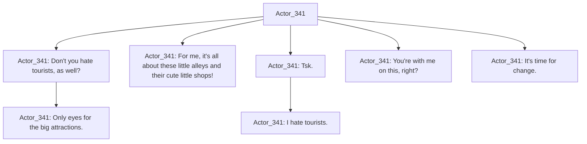

# Characters/Natasza

```mermaid
graph TD
    341_0["Actor_341"]
    341_1["Actor_341: Don't you hate tourists, as well?"]
    341_2["Actor_341: Only eyes for the big attractions."]
    341_3["Actor_341: For me, it's all about these little alleys and their cute little shops!"]
    341_4["Actor_341: Tsk."]
    341_5["Actor_341: I hate tourists."]
    341_6["Actor_341: You're with me on this, right?"]
    341_7["Actor_341: It's time for change."]
    341_0 --> 341_1
    341_0 --> 341_3
    341_0 --> 341_4
    341_0 --> 341_6
    341_0 --> 341_7
    341_1 --> 341_2
    341_4 --> 341_5
```