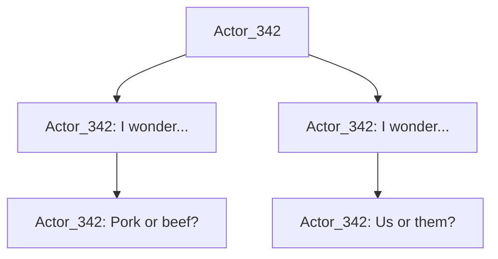

# Characters/Neil

```mermaid
graph TD
    342_0["Actor_342"]
    342_1["Actor_342: I wonder..."]
    342_2["Actor_342: Pork or beef?"]
    342_3["Actor_342: I wonder..."]
    342_4["Actor_342: Us or them?"]
    342_0 --> 342_1
    342_0 --> 342_3
    342_1 --> 342_2
    342_3 --> 342_4
```