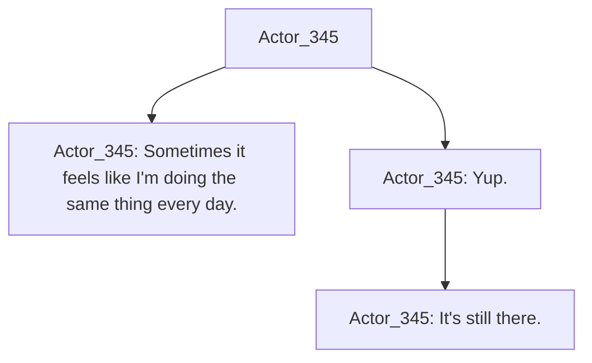

# Characters/Nicolai

```mermaid
graph TD
    345_0["Actor_345"]
    345_1["Actor_345: Sometimes it feels like I'm doing the same thing every day."]
    345_2["Actor_345: Yup."]
    345_3["Actor_345: It's still there."]
    345_0 --> 345_1
    345_0 --> 345_2
    345_2 --> 345_3
```