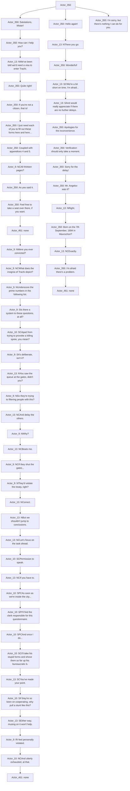

# Characters/Nikoleta

```mermaid
graph TD
    350_0["Actor_350"]
    350_1["Actor_350: Salutations, Mister!"]
    350_2["Actor_350: How can I help you?"]
    350_3["Actor_13: NWe've been told we'd need a visa to enter Trachi."]
    350_4["Actor_350: Quite right!"]
    350_5["Actor_350: If you're not a citizen, that is!"]
    350_6["Actor_350: I just need each of you to fill out these forms here and here..."]
    350_7["Actor_350: Coupled with appendices 4 and 5."]
    350_8["Actor_9: NCAll thirteen pages?"]
    350_9["Actor_350: As you said it."]
    350_10["Actor_350: Feel free to take a seat over there, if you want."]
    350_11["Actor_461: none"]
    350_12["Actor_9: NWere you ever convicted?"]
    350_13["Actor_9: NCWhat does the insignia of Trachi depict?"]
    350_14["Actor_9: NUnderscore the prime numbers in the following list."]
    350_15["Actor_9: SIs there a system to these questions, at all?"]
    350_16["Actor_10: SCApart from trying to provoke a killing spree, you mean?"]
    350_17["Actor_9: SIt's deliberate, isn't it?"]
    350_18["Actor_13: NYou saw the queue at the gates, didn't you?"]
    350_19["Actor_9: NSo they're trying to filtering people with this?"]
    350_20["Actor_13: NCAnd delay the others."]
    350_21["Actor_9: NWhy?"]
    350_22["Actor_13: NCBeats me."]
    350_23["Actor_9: NCIf they shut the gates..."]
    350_24["Actor_9: NThey'd violate the treaty, right?"]
    350_25["Actor_13: NCorrect."]
    350_26["Actor_13: NBut we shouldn't jump to conclusions."]
    350_27["Actor_13: NCLet's focus on the task ahead."]
    350_28["Actor_10: SCPermission to speak."]
    350_29["Actor_13: NCIf you have to."]
    350_30["Actor_10: SPCAs soon as we're inside the city..."]
    350_31["Actor_10: SPI'll find the clerk responsible for this questionnaire."]
    350_32["Actor_10: SPCAnd once I do..."]
    350_33["Actor_10: SCI'll take his stupid forms and shove them so far up his bureaucratic b-"]
    350_34["Actor_13: SCYou've made your point."]
    350_35["Actor_10: SIf they're so keen on cooperating, why pull a stunt like this?"]
    350_36["Actor_13: SEither way, musing on it won't help."]
    350_37["Actor_9: RI feel personally violated."]
    350_38["Actor_10: NCAnd utterly exhausted, at that."]
    350_39["Actor_461: none"]
    350_40["Actor_350: Hello again!"]
    350_41["Actor_13: NThere you go."]
    350_42["Actor_350: Wonderful!"]
    350_43["Actor_13: SCWe're a bit short on time, I'm afraid..."]
    350_44["Actor_13: SAnd would really appreciate if there are no further delays."]
    350_45["Actor_350: Apologies for the inconvenience."]
    350_46["Actor_350: Verification should only take a moment."]
    350_47["Actor_350: Sorry for the delay!"]
    350_48["Actor_350: Mr. Angelov was it?"]
    350_49["Actor_13: NRight."]
    350_50["Actor_350: Born on the 7th September, 1894 in Mavrochori?"]
    350_51["Actor_13: NCExactly."]
    350_52["Actor_350: I'm afraid there's a problem."]
    350_53["Actor_461: none"]
    350_54["Actor_350: I'm sorry, but there's nothing I can do for you."]
    350_0 --> 350_1
    350_0 --> 350_40
    350_0 --> 350_54
    350_1 --> 350_2
    350_2 --> 350_3
    350_3 --> 350_4
    350_4 --> 350_5
    350_5 --> 350_6
    350_6 --> 350_7
    350_7 --> 350_8
    350_8 --> 350_9
    350_9 --> 350_10
    350_10 --> 350_11
    350_11 --> 350_12
    350_12 --> 350_13
    350_13 --> 350_14
    350_14 --> 350_15
    350_15 --> 350_16
    350_16 --> 350_17
    350_17 --> 350_18
    350_18 --> 350_19
    350_19 --> 350_20
    350_20 --> 350_21
    350_21 --> 350_22
    350_22 --> 350_23
    350_23 --> 350_24
    350_24 --> 350_25
    350_25 --> 350_26
    350_26 --> 350_27
    350_27 --> 350_28
    350_28 --> 350_29
    350_29 --> 350_30
    350_30 --> 350_31
    350_31 --> 350_32
    350_32 --> 350_33
    350_33 --> 350_34
    350_34 --> 350_35
    350_35 --> 350_36
    350_36 --> 350_37
    350_37 --> 350_38
    350_38 --> 350_39
    350_40 --> 350_41
    350_41 --> 350_42
    350_42 --> 350_43
    350_43 --> 350_44
    350_44 --> 350_45
    350_45 --> 350_46
    350_46 --> 350_47
    350_47 --> 350_48
    350_48 --> 350_49
    350_49 --> 350_50
    350_50 --> 350_51
    350_51 --> 350_52
    350_52 --> 350_53
```